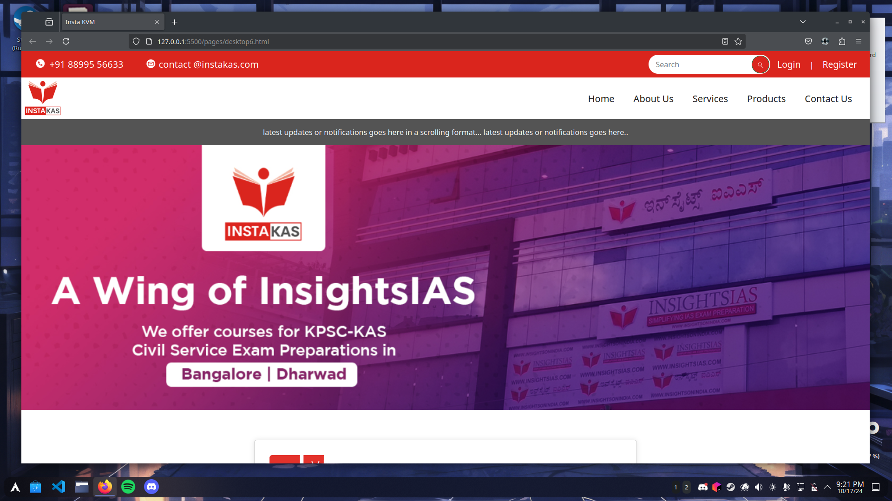
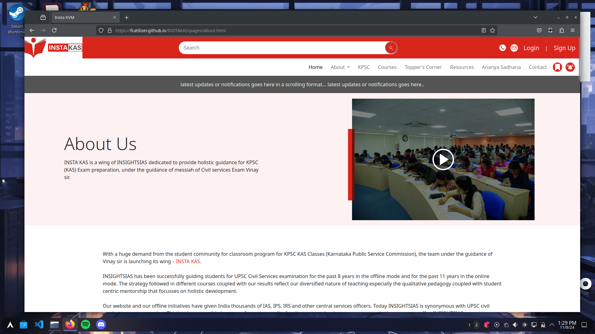
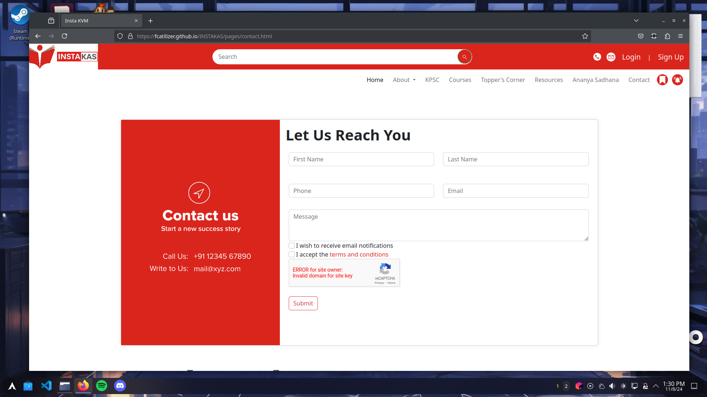

## InstKAS

<div style="display: flex; align-items: center; justify-content: center;">
  <a href="https://getbootstrap.com/">
    
  </a>
  <a href="https://www.figma.com/design/c2hRWKAuq2Xn1vMU3v16Cj/Insta-KAS-(21-06-23)?node-id=2311-22&node-type=frame&t=QipoJUq1gnDsHnIm-0">
    
  </a>
</div>

#### Build on Bootstrap. A FrontEnd Project of Internship. 

#### I don't own any right to this design. It's an Internship project, with figma designs given by Vraio Software Solutions

#### To see the initial Figma Design click on the Figma logo above.

## NOTE
- [x] ```index.html``` file is main and ```test.html``` file is for testing purpose.
- [x] Check other pages inside ```/pages``` folder

## Screenshots
#### Home Screen
 
<div style="display: flex; overflow-x: scroll; gap: 10px;">
    
    
    
</div>
